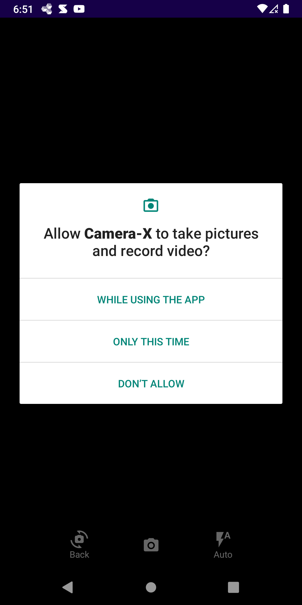
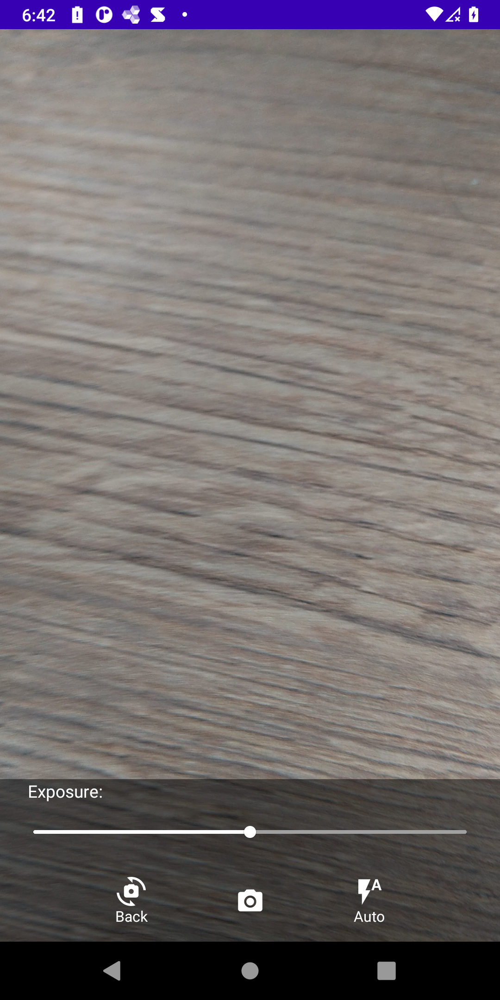

# Image-Capture

Android project with Camera X Api for Image Capture.   
The user can toggle between the front or back camera, select flash mode, and adjust the exposure luminosity of the camera   
Captured image will be saved in the app's private storage

# Technologies Used
<ul>
  <li>Navigation Component: To navigate between fragments</li>
  <li>Koin: For Dependency Injection</li>
  <li>Permission Manager: Manage Camera Permission while using the app</li>
  <li>Android Lifecycle: Performing threading operation with lifecycle awareness </li>
  <li>Camera X: Jetpack Library to use the camera of Android phone for recording video </li>
</ul>  

# Screenshots 
<h2>2. Permission Handler</h2> 

The app will check that all required permissions are granted

<h3>2.1 Camera Permission Request</h3>

<h2>3. Camera </h2> 

